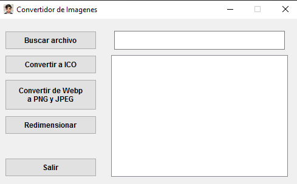
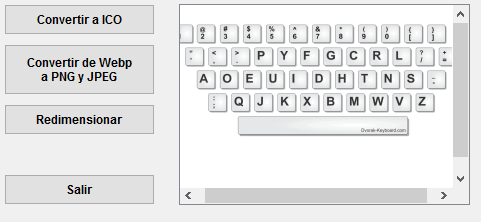
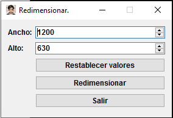

# Convert images

This script was primarily developed to convert PNG or JPG images into an icon (ICO), but it can now also be used to convert WebP images to PNG and JPG as well.

You don't have to use an online service to convert it.

## Features

- Convert png or jpg file to ico
- Convert webp files to png and jpg
- Resize images

